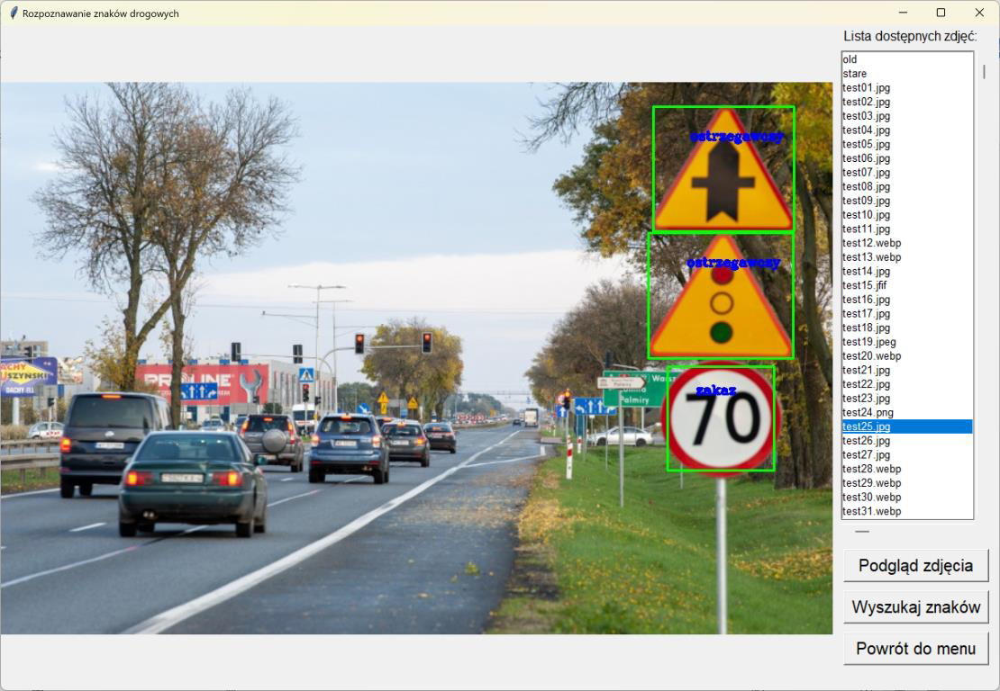
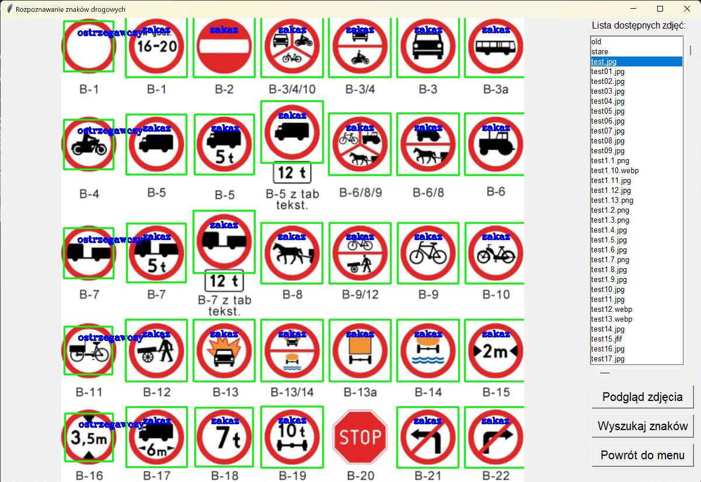
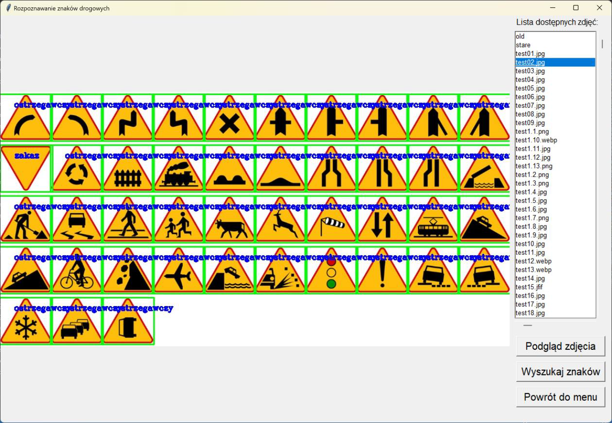

## Traffic Sign Recognition

## Technology
* Python 3.9.7
* OpenCV
* Tkinter
* Pillow

## Short description
The application allows you to detect and recognize Polish types of road signs. Neural networks were not used for recognition, but template matching with prior image processing. For this reason, the resulting diagnosis may not be correct.

## Algorithm operation
1. From color filtering leaving only red, yellow and blue (each separately)
2. Improved visibility of object edges
3. Isolation of the areas where the objects are located from the photos.
4. A template comparison was performed in each area
5. The character type with the greatest match is assigned

## Presentation of the program

